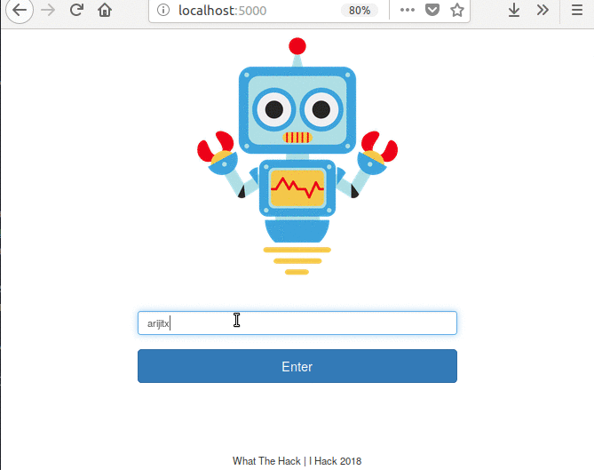

# I_hack 18
# Python Flask based Context Aware Restaurant Chatbot built with Rasa

## Dependencies

- rasa_core '0.8.0a4'
- rasa_nlu
- MITIE python
- Flask

## How to Run

1. Download MITIE feature extractor [here](https://github.com/mit-nlp/MITIE/releases/download/v0.4/MITIE-models-v0.2.tar.bz2) you need the file total_word_feature_extractor.dat

2. Go to Rasa_Core_service/models/nlu/default/current
update metadata.json with your MITIE total_word_feature_extractor.dat path

    "mitie_file": "/home/r3v0/MITIE-models/english/total_word_feature_extractor.dat",

3. Change Zomato API key in web_app/response_gen.py line 20 and 25

4.

      bash run_rasa_service.sh
      bash run_web_app.sh

## Demo

## Team

- [Debanjan](https://github.com/debanjanxy)
- [Himadri](https://github.com/pheonix123)
- [Smartika]
